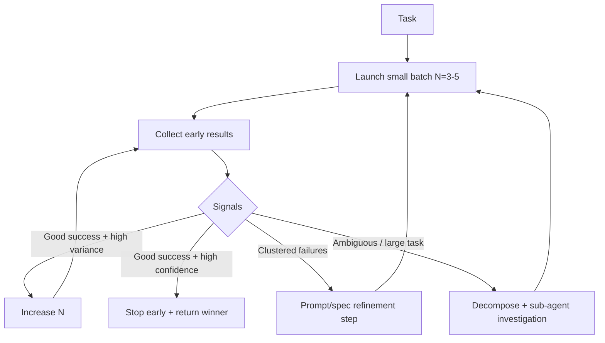

## Problem

Parallel sandboxes are intoxicating: you can spawn 10... 100... 1000 runs. But two things break quickly:

1. **Diminishing returns:** After some N, you're mostly paying for redundant failures or near-duplicate solutions
2. **Prompt fragility:** If the prompt is underspecified, scaling N just scales errors (lots of sandboxes fail fast)
3. **Resource risk:** Unbounded fan-out can overwhelm budgets, rate limits, or queues

Static "N=10 always" policies don't adapt to task difficulty, model variance, or observed failure rates.

## Solution

Add a controller that *adapts fan-out in real time* based on observed signals from early runs.

**Core loop:**

1. **Start small:** Launch a small batch (e.g., N=3-5) in parallel
2. **Early signal sampling:** As soon as the first X runs finish (or after T seconds), compute:

   - success rate (exit code / test pass)
   - diversity score (are solutions meaningfully different?)
   - judge confidence / winner margin
   - error clustering (same error everywhere vs varied errors)

3. **Decide next action:**

   - **Scale up** if: success rate is good but quality variance is high (you want a better winner)
   - **Stop early** if: judge is confident + tests pass + solutions converge
   - **Refine prompt / spec** if: error clustering is high (everyone fails the same way)
   - **Switch strategy** if: repeated failure suggests decomposition is needed (spawn investigative sub-agent)

4. **Budget guardrails:** Enforce max sandboxes, max runtime, and "no-progress" stop conditions

## How to use it

Use when:

- You're doing "best-of-N codegen + execution" in sandboxes
- You have cheap objective checks (unit tests, static analysis, schema validation)
- Latency and cost matter: you want the *minimum N* that achieves reliability

Concrete heuristics (example):

- Start N=3
- If >=2 succeed but disagree and judge confidence < 0.65 -> add +3 more
- If 0 succeed and top error signature covers >70% runs -> run a "spec clarifier" step, then restart
- Hard cap: N_max (e.g., 50), runtime cap, and "two refinement attempts then decompose"

## Trade-offs

**Pros:**

- Prevents "scale errors" when prompts are bad
- Lowers spend by stopping early when a clear winner appears
- Makes sandbox swarms production-safe via budgets and no-progress stopping

**Cons:**

- Requires instrumentation (collecting failure signatures, confidence, diversity)
- Needs careful defaults to avoid oscillation (scale up/down thrash)
- Bad scoring functions can cause premature stopping

## References

* [Labruno: Scaling number of parallel sandboxes + judging winners (video)](https://www.youtube.com/watch?v=zuhHQ9aMHV0)
* [Labruno (GitHub)](https://github.com/nibzard/labruno-agent)
* Related patterns: [Swarm Migration Pattern](swarm-migration-pattern.md) (batch tuning, resource caps), [Sub-Agent Spawning](sub-agent-spawning.md) (switch to decomposition when needed)
