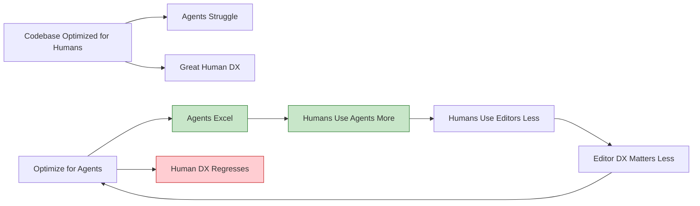

## Problem

When introducing AI agents to a codebase, there's a natural tendency to preserve the human developer experience (DX). However, this limits agent effectiveness because the codebase remains optimized for humans, not for the AI workers who will increasingly operate autonomously.

A related problem: even good models struggle without clear feedback loops. When an agent can't verify its changes work, it fails not because of capability limits but because the codebase isn't "welded" to the agent.

## Solution

**Optimize the codebase for agents first, humans second.** Accept that tooling, workflows, and even the editor experience may regress for humans in order to unlock dramatically better agent performance.

**The counterintuitive insight:** Once you embrace agent-optimized workflows, you'll use the human-centric tools (like VS Code) less anyway, so regressing them doesn't matter as much.

**Real example from AMP:**

The team built Zveltch (Zig implementation of spelt-check) to make spell-check fast for agents. This actually made the VS Code experience worse for humans. They had a difficult decision: preserve human DX or optimize for agents?

They ultimately chose to optimize for agents, leading to a "snowball effect":
- Agent tooling gets better
- Humans use agents more
- Humans use editors less
- Editor experience matters less
- More incentive to optimize for agents



**Key principle:** Be willing to let go of traditional developer tooling shibboleths.

**"Welding the agent to the codebase":**

The metaphor of welding means creating tight, automated feedback loops so the agent can:
- Verify its changes work automatically
- Get clear signals about success/failure
- Iterate without human intervention

> "You want to weld the agent to the codebase. You want to make sure that the agent, when you combine it with your codebase, knows exactly how to verify its changes and get feedback and make sure that what it did actually works."

Practical examples:
- **Terminal emulator with screenshot flag**: Added `--capture-to` flag so agent could take screenshots and verify rendering fixes
- **CLI data-only output**: Created new subcommand that outputs raw data (no UI formatting) so agent can parse results programmatically
- **Test commands**: Single-command test execution (`pnpm test`) with cached results

## How to use it

**Areas where agent optimization may differ from human optimization:**

**1. Command interfaces**

```yaml
# Human-optimized CLI
- Interactive prompts
- Colored output
- Progress bars
- Help text and menus

# Agent-optimized CLI
- Single command interface (e.g., `pnpm test`)
- Machine-readable output
- Cached results
- Minimal verbose output
```

**2. Documentation and knowledge**

```yaml
# Human-optimized docs
- Narrative explanations
- Tutorials and guides
- Screenshots and diagrams

# Agent-optimized docs
- Structured reference
- Code examples
- Clear input/output formats
- Skills that encapsulate workflows
```

**3. Testing and validation**

```yaml
# Human-optimized tests
- Descriptive test names
- Helpful error messages
- Debug output

# Agent-optimized tests
- Fast execution
- Cached results
- Clear pass/fail signals
- Automated fix suggestions
```

**4. Skills and capabilities**

The most impactful optimization: build **skills** that encapsulate your codebase's unique operations.

From AMP:
- GCloud skill for log analysis (replaces need for web dashboards)
- BigQuery skill for data queries
- Release management skills
- Deployment skills

**5. Agents.md files**

Create `AGENTS.md` or similar documentation that explains:
- How to test the application
- How to authenticate
- What feedback mechanisms to use
- Special considerations for automated interaction

**The "Agent-Native Codebase" Checklist (2026 version of Joel Spolsky's test):**

| Joel's Test (2004) | Agent Test (2026) |
|-------------------|-------------------|
| Can somebody ship something on day one? | Can an agent ship something in 10 minutes? |
| One-command dev environment setup | One-command test/verify cycle |
| Easy to push to production | Easy for agent to deploy and verify |
| Easy to review code | Easy for agent to self-verify |
| CI runs tests | CI provides machine-readable feedback |
| Good documentation | AGENTS.md with workflow instructions |

**Decision framework:**

When faced with a choice between human and agent optimization:

| Question | If Yes → | If No → |
|----------|----------|---------|
| Do humans use this daily? | Consider hybrid | Optimize for agents |
| Will agents use this 10x more than humans? | Optimize for agents | Preserve human DX |
| Is this a core developer workflow? | Hybrid approach | Agent-first |
| Does this require human judgment? | Human-first | Agent-first |

**The snowball effect in action:**

1. Optimize tooling for agents (regress human DX)
2. Agents become more effective
3. Humans use agents more, direct tools less
4. Human DX matters less (you're not in the editor as much)
5. More freedom to optimize for agents
6. Repeat

## Trade-offs

**Pros:**

- **Dramatically better agent performance**: Agents work faster and more reliably
- **Accelerates transition to agent-first workflows**: Incentivizes using agents over manual work
- **Future-proof**: Positions codebase for increasing AI autonomy
- **Compound improvements**: Better agents → more usage → more investment → better agents

**Cons:**

- **Human DX regresses**: Traditional workflows may become worse
- **Team resistance**: Developers may resist "worse" tools
- **Hybrid team challenges**: Some team members may not use agents as much
- **Lock-in risk**: Heavy investment in agent-specific patterns

**The psychological shift:**

> "Agents are not a confirmation that these complex build tools and reproducible builds will win. Like, it's just I, you know, like I think they they're really good at using dumb tools, you know, like you don't need heavy crazy tools"

Agents excel with simple, reliable, dumb tools. Complex tools designed for humans often add unnecessary overhead.

**When to optimize for agents:**

- Agents will use a workflow 10x more than humans
- The workflow is automatable and well-defined
- Speed matters more than user experience
- You're committed to agent-first development

**When to preserve human DX:**

- Workflow requires human creativity or judgment
- Humans are primary users (agents rarely touch it)
- The workflow is exploratory or poorly specified
- Team is not fully bought into agent-first approach

## References

* [Raising an Agent Episode 9: The Assistant is Dead, Long Live the Factory](https://www.youtube.com/watch?v=2wjnV6F2arc) - AMP (Thorsten Ball, Quinn Slack, 2025)
* [Raising an Agent Episode 10: The Assistant is Dead, Long Live the Factory](https://www.youtube.com/watch?v=4rx36wc9ugw) - AMP (Thorsten Ball, Quinn Slack, 2025)
* Related: [Skill Library Evolution](skill-library-evolution.md), [Factory over Assistant](factory-over-assistant.md)
