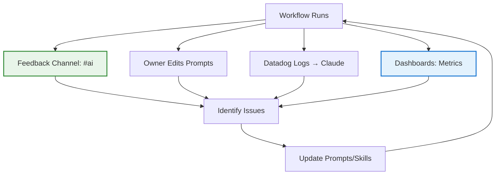

## Problem

Agent usage reveals gaps in prompts, skills, and tools—but how do you systematically improve them? When a workflow fails or behaves sub-optimally, you need multiple mechanisms to capture feedback and iterate. Single approaches aren't enough; you need a **multi-pronged refinement strategy**.

## Solution

Implement **multiple complementary refinement mechanisms** that work together. No single mechanism catches all issues—you need layered approaches.

**Four key mechanisms:**

**1. Responsive Feedback (Primary)**
- Monitor internal `#ai` channel for issues
- Skim workflow interactions daily
- This is the most valuable ongoing source of improvement

**2. Owner-Led Refinement (Secondary)**
- Store prompts in editable documents (Notion, Google Docs)
- Most prompts editable by anyone at the company
- Include prompt links in workflow outputs (Slack messages, Jira comments)
- Prompts must be discoverable + editable

**3. Claude-Enhanced Refinement (Specialized)**
- Use Datadog MCP to pull logs into skill repository
- Skills are a "platform" used by many workflows
- Often maintained by central AI team, not individual owners

**4. Dashboard Tracking (Quantitative)**
- Track workflow run frequency and errors
- Track tool usage (how often each skill loads)
- Data-driven prioritization of improvements



## How to use it

**Implementation checklist:**

- [ ] **Feedback channel**: Internal Slack/Discord for agent issues
- [ ] **Editable prompts**: Store in Notion/docs, not code
- [ ] **Prompt links**: Include in every workflow output
- [ ] **Log access**: Datadog/observability with MCP integration
- [ ] **Dashboards**: Track workflow runs, errors, tool usage

**Refinement workflow:**

```python
# After each workflow run, include link
workflow_result = {
    "output": "...",
    "prompt_link": "https://notion.so/prompt-abc123"
}
```

**Discovery strategy:**

- **Daily**: Skim feedback channel, review workflow interactions
- **Weekly**: Review dashboard metrics for error spikes
- **Ad-hoc**: Pull logs when specific issues reported
- **Quarterly**: Comprehensive prompt/skill audit

**Post-run evals (next step):**

Include subjective eval after each run:

- Was this workflow effective?
- What would have made it better?
- Human-in-the-loop to nudge evolution

## Trade-offs

**Pros:**

- **Multi-layered**: Catches issues different mechanisms miss
- **Continuous**: Always improving, not episodic
- **Accessible**: Anyone can contribute to improvement
- **Data-driven**: Dashboards prioritize what matters
- **Skill-sharing**: Central team can maintain platform-level skills

**Cons:**

- **No silver bullet**: Can't eliminate any mechanism
- **Maintenance overhead**: Multiple systems to manage
- **Permission complexity**: Need balanced edit access
- **Alert fatigue**: Too many signals can overwhelm

**Workflow archetypes:**

| Type | Refinement Strategy |
|------|---------------------|
| **Chatbots** | Post-run evals + human-in-the-loop |
| **Well-understood workflows** | Code-driven (deterministic) |
| **Not-yet-understood workflows** | The open question |

**Open challenge:** How to scalably identify and iterate on "not-yet-well-understood" workflows without product engineers implementing each individually?

## References

* [Iterative prompt and skill refinement](https://lethain.com/agents-iterative-refinement/) - Will Larson (Imprint, 2026)
* Related: Dogfooding with Rapid Iteration, Compounding Engineering, Memory Synthesis from Execution Logs
