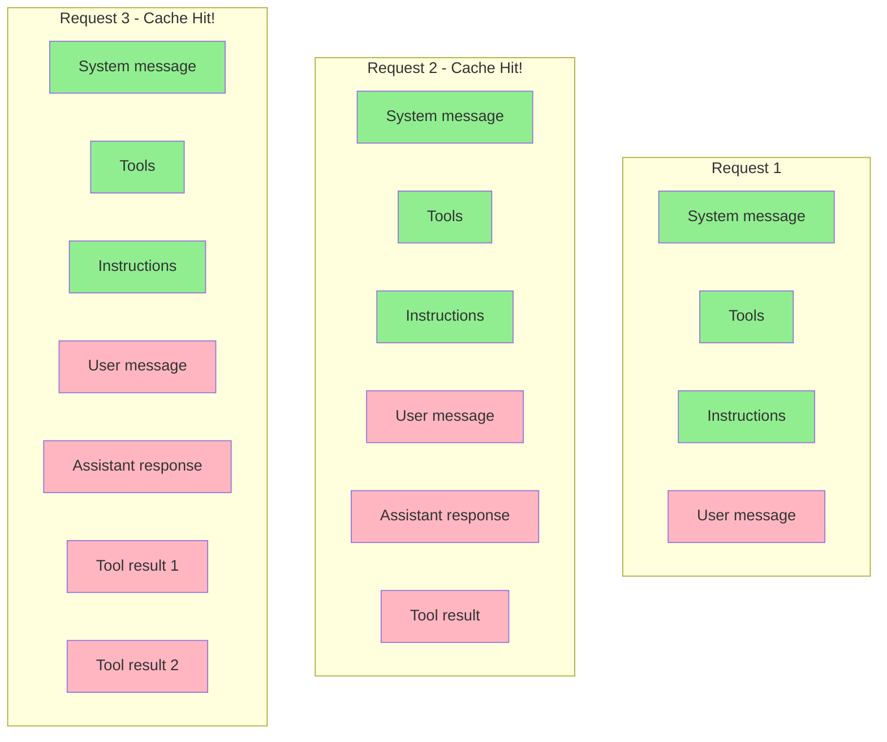

## Problem

Long-running agent conversations with many tool calls can suffer from **quadratic performance degradation**:

- **Growing JSON payloads**: Each iteration sends the entire conversation history to the API
- **Expensive re-computation**: Without caching, the model re-processes the same static content repeatedly
- **ZDR constraints**: Zero Data Retention (ZDR) policies prevent server-side state, ruling out `previous_response_id` optimization
- **Configuration changes**: Mid-conversation changes (sandbox, tools, working directory) can break cache efficiency

As conversations grow, inference costs and latency increase quadratically without proper caching strategies.

## Solution

Maintain prompt cache efficiency through **exact prefix preservation** - always append new messages rather than modifying existing ones, and carefully order messages to maximize cache hits.

**Core insight**: Prompt caches only work on **exact prefix matches**. If the first N tokens of a request match a previous request, the cached computation can be reused.

**Message ordering strategy:**

1. **Static content first** (beginning of prompt - cached across all requests):
   - System message (if server-controlled)
   - Tool definitions (must be in consistent order)
   - Developer instructions
   - User/project instructions

2. **Variable content last** (end of prompt - changes per request):
   - User message
   - Assistant messages
   - Tool call results (appended iteratively)

**Configuration change via insertion:**

When configuration changes mid-conversation, **insert a new message** rather than modifying an existing one:

```
[Static prefix...]
<sandbox_config_v1>     // Original config message
[Conversation...]

<sandbox changed>
<sandbox_config_v2>     // NEW message inserted
[Conversation continues...]
```

This preserves the exact prefix of all previous messages, maintaining cache hits.

**What breaks cache hits:**

- Changing the list of available tools (position-sensitive)
- Reordering messages
- Modifying existing message content
- Changing the model (affects server-side system message)

**Stateless design for ZDR:**

Avoid `previous_response_id` to support Zero Data Retention. Instead, rely on prompt caching for linear performance:

```
Without previous_response_id:
- Quadratic network traffic (send full JSON each time)
- Linear sampling cost (due to prompt caching)

With previous_response_id:
- Linear network traffic
- But violates ZDR (server must store conversation state)
```

## Example



**Green = Cached** (exact prefix match) | **Pink = Recomputed** (new tokens)

## How to use it

**Prompt construction checklist:**

1. **Order messages by stability**: Static → Variable
2. **Never modify existing messages**: Always append new ones
3. **Keep tool order consistent**: Enumerate tools in deterministic order
4. **Insert, don't update**: For config changes, add new messages

**Handling configuration changes:**

| Change Type | What NOT to do | What TO do |
|-------------|----------------|------------|
| Sandbox/approval mode | Modify permission message | Insert new `role=developer` message |
| Working directory | Modify environment message | Insert new `role=user` message |
| Tool list | Change mid-conversation | Avoid if possible; breaks cache |

**MCP server considerations:**

MCP servers can emit `notifications/tools/list_changed` to indicate tool list changes. **Avoid honoring this mid-conversation** as it breaks cache hits. Instead:
- Delay tool refresh until conversation boundary
- Or accept the cache miss as necessary trade-off

**Implementation sketch:**

```typescript
function buildPrompt(state: ConversationState): Prompt {
  const items: PromptItem[] = [];

  // Static prefix (cached)
  items.push({ role: 'system', content: state.systemMessage });
  items.push({ type: 'tools', tools: state.tools });  // Consistent order!
  items.push({ role: 'developer', content: state.instructions });

  // Variable content (appended)
  items.push(...state.history);

  return { items };
}

function handleConfigChange(
  state: ConversationState,
  newConfig: SandboxConfig
): ConversationState {
  // DON'T: Modify existing permission message
  // DO: Insert new message
  return {
    ...state,
    history: [
      ...state.history,
      {
        role: 'developer',
        content: formatSandboxConfig(newConfig),
      },
    ],
  };
}
```

## Trade-offs

**Pros:**

- **Linear sampling cost**: Prompt caching makes repeated inference linear rather than quadratic
- **ZDR-compatible**: Stateless design supports Zero Data Retention policies
- **No server state**: Avoids `previous_response_id` complexity
- **Simple conceptual model**: Exact prefix matching is easy to reason about

**Cons:**

- **Quadratic network traffic**: JSON payload size still grows quadratically (only sampling is cached)
- **Cache fragility**: Mid-conversation changes (tools, model) break prefix matching
- **Disciplined ordering required**: All static content must come before variable content
- **Tool enumeration complexity**: Must maintain consistent tool ordering
- **MCP server limitations**: Dynamic tool changes can cause cache misses

## References

* [Unrolling the Codex agent loop | OpenAI Blog](https://openai.com/index/unrolling-the-codex-agent-loop/)
* [Prompt Caching Documentation | OpenAI](https://platform.openai.com/docs/guides/prompt-caching)
* [Codex CLI | GitHub](https://github.com/openai/codex)
* Related: [Context Window Auto-Compaction](/patterns/context-window-auto-compaction)
