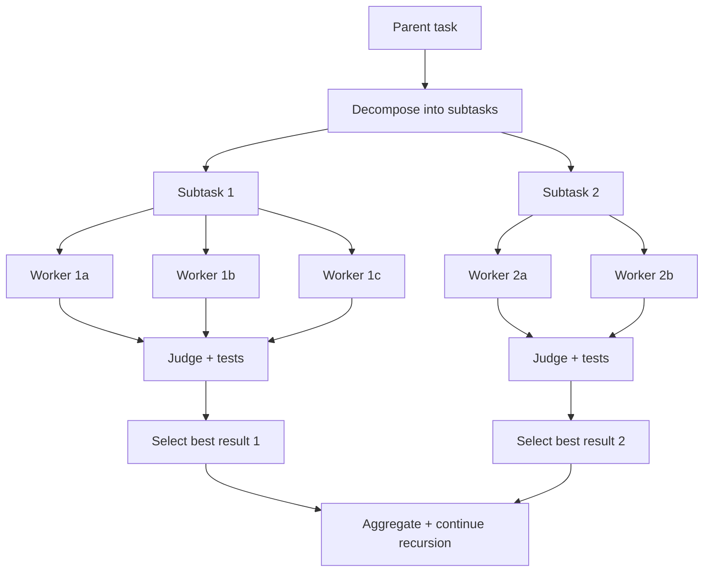

## Problem

Recursive delegation (parent agent -> sub-agents -> sub-sub-agents) is great for decomposing big tasks, but it has a failure mode:

- A single weak sub-agent result can poison the parent's next steps (wrong assumption, missed file, bad patch)
- Errors compound up the tree: "one bad leaf" can derail the whole rollout
- Pure recursion also underuses parallelism when a node is uncertain: you really want multiple shots *right where the ambiguity is*

Meanwhile, "best-of-N" parallel attempts help reliability, but without structure they waste compute by repeatedly solving the *same* problem instead of decomposing it.

## Solution

At *each node* in a recursive agent tree, run **best-of-N** for the current subtask before expanding further:

1. **Decompose:** Parent turns task into sub-tasks (like normal recursive delegation)
2. **Parallel candidates per subtask:** For each subtask, spawn **K candidate workers** in isolated sandboxes (K=2-5 typical)
3. **Score candidates:** Use a judge that combines:
   - Automated signals (tests, lint, exit code, diff size, runtime)
   - LLM-as-judge rubric (correctness, adherence to constraints, simplicity)
4. **Select + promote:** Pick the top candidate as the "canonical" result for that subtask
5. **Escalate uncertainty:** If the judge confidence is low (or candidates disagree), either:
   - Increase K for that subtask, or
   - Spawn a focused "investigator" sub-agent to gather missing facts, then re-run selection
6. **Aggregate upward:** Parent synthesizes selected results and continues recursion

## How to use it

Best for tasks where:

- Subtasks are *shardable*, but each shard can be tricky (ambiguous API use, repo-specific conventions)
- You can score outputs cheaply (unit tests, type checks, lint, golden files)
- "One wrong move" is costly (migration diffs, security-sensitive changes, large refactors)

Practical defaults:

- Start with **K=2** for most subtasks
- Increase to **K=5** only on "high uncertainty" nodes (low judge confidence, conflicting outputs, failing tests)
- Keep the rubric explicit: "must pass tests; minimal diff; no new dependencies; follow style guide"

## Trade-offs

**Pros:**

- Much more robust than single-recursion: local uncertainty gets extra shots
- Compute is targeted: you spend K where it matters, not globally
- Works naturally with sandboxed execution and patch-based workflows

**Cons:**

- More orchestration complexity (judge, scoring, confidence thresholds)
- Higher cost/latency if you overuse K
- Judge quality becomes a bottleneck; add objective checks whenever possible

## References

* [Labruno: Parallel sandboxes + LLM judge selects best implementation (video)](https://www.youtube.com/watch?v=zuhHQ9aMHV0)
* [Labruno (GitHub)](https://github.com/nibzard/labruno-agent)
* [Daytona RLM Guide: Recursive delegation with sandboxed execution](https://www.daytona.io/docs/en/recursive-language-models/)
* [Recursive Language Models (arXiv 2512.24601): Recursion as inference-time scaling for long context](https://arxiv.org/abs/2512.24601)
* Related patterns: [Sub-Agent Spawning](sub-agent-spawning.md), [Swarm Migration Pattern](swarm-migration-pattern.md), [Self-Critique / Evaluator loops](self-critique-evaluator-loop.md)
