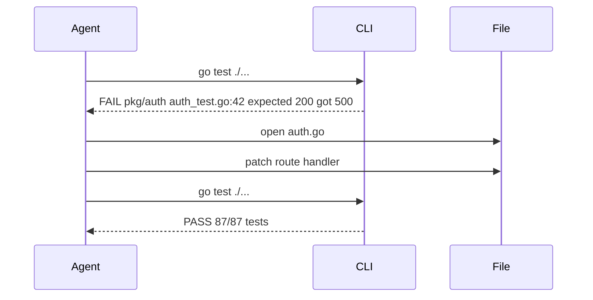

## Problem
Polishing a single prompt can't cover every edge-case; agents need ground truth to self-correct.

Additionally, agents need to integrate **human feedback** (positive and corrective) to improve session quality over time. Projects that better respond to user feedback have fewer corrections and better outcomes.

## Solution
Expose **iterative, machine-readable feedback**—compiler errors, test failures, linter output, screenshots—after every tool call.
The agent uses diagnostics to plan the next step, leading to emergent self-debugging.

**Integrate human feedback patterns:**

- **Recognize positive feedback** to reinforce patterns that work
- **Learn from corrections** to avoid repeating mistakes
- **Adapt based on user communication style** and preferences
- **Track what works** for specific users over time

**Evidence from 88 session analysis:**

| Project | Positive | Corrections | Success Rate |
|---------|----------|-------------|--------------|
| nibzard-web | 8 | 2 | High (80%) |
| 2025-intro-swe | 1 | 0 | High (100%) |
| awesome-agentic-patterns | 1 | 5 | Low (17%) |
| skills-marketplace | 0 | 2 | Low (0%) |

**Key insight**: Projects with more positive feedback had better outcomes. Reinforcement works—it's not just politeness, it's training data for the agent.

Modern models like Claude Sonnet 4.5 are increasingly proactive in creating their own feedback loops by writing and executing short scripts and tests, even for seemingly simple verification tasks (e.g., using HTML inspection to verify React app behavior).

## Example

## References

* [SKILLS-AGENTIC-LESSONS.md](https://github.com/nibzard/SKILLS-AGENTIC-LESSONS) - Analysis showing positive feedback correlation with better session outcomes (nibzard-web: 8 positive, 2 corrections vs. awesome-agentic-patterns: 1 positive, 5 corrections)
* Raising An Agent - Episode 1 & 3 discussions on "give it errors, not bigger prompts."
* [Cognition AI: Devin & Claude Sonnet 4.5](https://cognition.ai/blog/devin-sonnet-4-5-lessons-and-challenges) - observes proactive testing behavior and custom script creation for feedback loops

[Source](https://www.nibzard.com/ampcode)