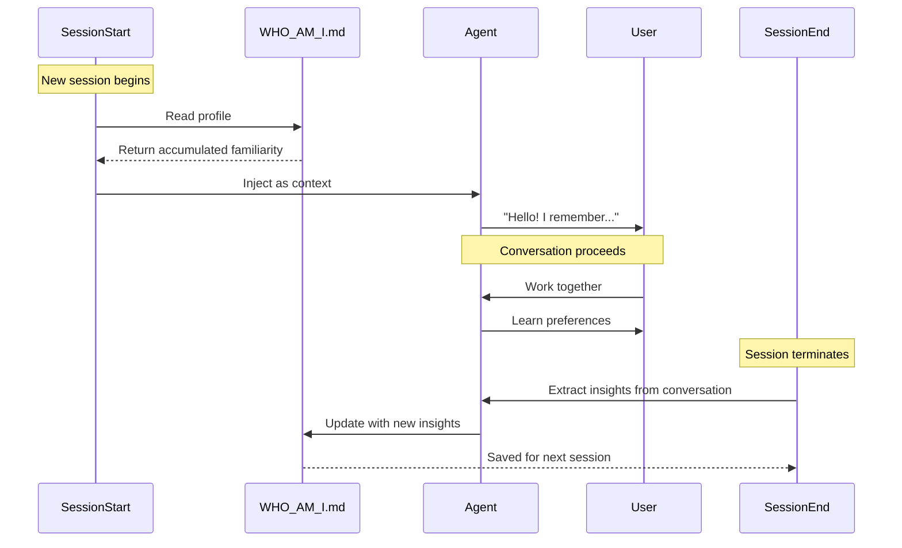

## Problem

AI agents lack continuous memory across sessions. Each conversation starts from zero, causing:

- **Lost familiarity**: The agent doesn't remember user preferences, goals, or working patterns
- **Repetitive explanations**: Users must re-explain context and preferences each session
- **Shallow relationships**: Agent cannot build deeper understanding of user's needs over time
- **Generic responses**: Without accumulated context, agents default to generic behaviors

While episodic memory systems store past *experiences*, they don't address the need for an evolving *self-identity*—who the agent is in relation to the user.

## Solution

Implement **dual-hook architecture** for self-identity accumulation:

1. **SessionStart Hook**: Inject accumulated identity/profile at session start
2. **SessionEnd Hook**: Extract new insights and refine the profile after each session
3. **Identity Document**: A persistent file (e.g., WHO_AM_I.md, SOUL.md) that evolves over time



**Core mechanism:**

```python
# SessionStart: Inject accumulated identity
def session_start_hook():
    profile = read_file("WHO_AM_I.md")
    inject_context(profile)

# SessionEnd: Refine identity with new insights
def session_end_hook(conversation):
    new_insights = extract_insights(conversation)
    current_profile = read_file("WHO_AM_I.md")
    updated_profile = merge_insights(current_profile, new_insights)
    write_file("WHO_AM_I.md", updated_profile)
```

**Profile structure typically includes:**

- **Project Goals**: Evolving list of priorities and focus areas
- **Preferences**: Coding opinions, tool choices, architectural preferences
- **Communication Style**: Tone preferences, formatting conventions
- **Workflow Patterns**: Research practices, decision-making patterns
- **Boundaries**: What the agent should/shouldn't do

## How to use it

**Implementation:**

1. Create identity document with initial structure
2. Configure SessionStart hook to read and inject it
3. Configure SessionEnd hook to refine it with new insights
4. Include instructions for when/how to update

**Example SessionStart hook (Claude Code):**

```python
#!/usr/bin/env python3
import json
from pathlib import Path

whoami_path = Path.cwd() / "WHO_AM_I.md"

if whoami_path.exists():
    with open(whoami_path) as f:
        profile = f.read()

    print(json.dumps({
        "hookSpecificOutput": {
            "additionalContext": profile
        }
    }))
```

**Example SessionEnd hook (Claude Code):**

```python
#!/usr/bin/env python3
import subprocess

PROMPT = """
Read WHO_AM_I.md and update it based on our conversation:
1. Extract NEW insights about the user
2. UPDATE each section (add new insights, keep existing)
3. Write updated content back
4. Update 'modified' date in frontmatter
"""

subprocess.run([
    "claude", "--continue", "-p", PROMPT,
    "--dangerously-skip-permissions"
])
```

**Prompting for self-refinement:**

The SessionEnd hook uses `--continue` to resume the conversation with a refinement prompt, allowing the agent to update its own identity document intelligently rather than through parsing.

## Trade-offs

**Pros:**

- **Continuous familiarity**: Agent "remembers" user across sessions
- **Deepening relationship**: Understanding accumulates over time
- **Reduced friction**: Less repetitive explanation of preferences
- **Personalized behavior**: Agent adapts to user's specific style
- **Transparent**: Identity is visible and editable by user

**Cons:**

- **Staleness risk**: Profile may become outdated if not updated
- **Overfitting**: Agent may become too specialized to one user
- **Context overhead**: Profile consumes tokens each session
- **Extraction noise**: SessionEnd may extract irrelevant "insights"
- **Requires hooks**: Needs lifecycle hook infrastructure

**Operational considerations:**

- Review and prune profile periodically
- Include metadata (created/modified dates) to track evolution
- Consider version control for profile changes
- Design prompts to avoid noise in insight extraction
- Balance specificity (more personalized) vs generality (more flexible)

## Example: WHO_AM_I Structure

```markdown
---
type: familiarity
created: 2025-01-24
modified: 2026-01-26
---

# Who Am I

This document accumulates familiarity across sessions.

## Project Goals

- [Evolving list of priorities, focus areas, and objectives]

## Preferences

- [Coding opinions, tool choices, architectural preferences]
- [Communication style and formatting conventions]
- [Workflow patterns and decision-making approaches]

## Boundaries

- [What the agent should always ask about before doing]
- [Privacy boundaries and ethical red lines]
```

## References

* Based on my personal bot WHO_AM_I system
* Related: [Dynamic Context Injection](dynamic-context-injection.md), [Episodic Memory Retrieval & Injection](episodic-memory-retrieval-injection.md), [Filesystem-Based Agent State](filesystem-based-agent-state.md)
