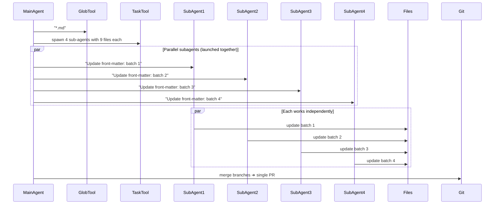

## Problem

Large multi-file tasks blow out the main agent's context window and reasoning budget. You need a way to delegate work to specialized agents with isolated contexts and tools.

## Solution

Let the main agent **spawn focused sub-agents**, each with its own fresh context, to work in parallel on shardable subtasks. Aggregate their results when done.

**Critical requirement**: Each subagent invocation must have a clear, specific task subject for traceability. Empty or generic subjects make parallel work untraceable and synthesis difficult. See [Subject Hygiene](subject-hygiene.md) for details.

**Implementation approaches:**

### 1. Declarative YAML Configuration

Define subagent types in configuration files with their own system prompts, allowed tools, and context windows:

```yaml
# subagents/planning.yaml
name: planning
system_prompt: "Break down complex tasks into steps..."
tools:
  - list_files
  - read_file
  # or inherit: all (from parent agent)

# subagents/think.yaml
name: think
system_prompt: "Analyze and refine reasoning..."
tools:
  - read_file
  - search
```

Agents invoke subagents via a dedicated tool:

```pseudo
subagent(agent_name, prompt, files)
```

This allows:

- **Virtual file isolation**: Subagent only sees files explicitly passed to it
- **Tool scoping**: Subagents can inherit all parent tools or use a subset
- **Specialized system prompts**: Each subagent type has predefined behavior

### 2. Dynamic Spawning

Spawn subagents on-demand for parallel task execution:

```pseudo
# Main agent creates todo list
files = glob("**/*.md")
batches = chunk(files, 9)

# Spawn subagents for each batch IN PARALLEL
for batch in batches:
    spawn_subagent(
        task="Update YAML front-matter in markdown files",  # Clear, specific subject
        files=batch,
        context=instructions
    )
# All subagents run concurrently, not sequentially
```

**Parallel delegation best practices:**

- **Launch independent tasks simultaneously**: Don't explore A, then B, then C sequentially
- **Use clear task subjects**: Each subagent needs a traceable identity (see [Subject Hygiene](subject-hygiene.md))
- **Plan synthesis upfront**: Define how main agent will combine subagent findings
- **Limit to 2-4 subagents**: Observed maximum in effective sessions; more adds coordination overhead

Recent developments show that improved agent [state externalization capabilities](proactive-agent-state-externalization.md) may make subagent delegation more practical by helping agents better identify which tasks are suitable for delegation and how to communicate necessary context to subagents.

## Example (YAML front-matter refactor)

**Parallel delegation with clear subjects:**



**Real-world example from nibzard-web:**

Four parallel subagents launched simultaneously:
- `"Newsletter component exploration"` → agent-a7911db
- `"Modal pattern discovery"` → agent-adeac17
- `"Search implementation research"` → agent-a03b9c9
- `"Log page analysis"` → agent-b84c3d1

Main agent synthesized findings and implemented unified approach.

## How to use it

**Use cases for subagents:**

1. **Context window management**: Process large files in subagents without polluting main context
   - Upload files to subagent
   - Extract specific data
   - Return summary to main agent

2. **Concurrent work**: Run multiple subagents in parallel, join on completion
   - Reduces clock-time for I/O-bound workflows
   - Network API calls can happen simultaneously

3. **Code-driven LLM invocation**: Hand off control to LLM for specific determination
   - Code workflow calls subagent
   - Subagent makes LLM-powered decision
   - Control returns to code with result

4. **Security isolation**: Separate tools/contexts in mutually isolated subagents
   - External resource retrieval isolated from internal access
   - Reduced blast radius for sensitive operations

**Declarative subagent setup:**

```yaml
# agents.yaml
subagents:
  planning:
    file: subagents/planning.yaml
    allowed_in:
      - main_agent
      - research_agent

  think:
    file: subagents/think.yaml
    allowed_in:
      - main_agent
```

**Virtual file passing:**

```pseudo
# Main agent
result = subagent(
    agent_name="planning",
    prompt="Analyze these files and create migration plan",
    files=["file1.ts", "file2.ts", "file3.ts"]
)
# Only these 3 files visible to planning subagent
```

**Recursive architecture insight:**

Some implementations treat every agent as a subagent, enabling flexible composition and consistent behavior across the system.

## Advanced usage: Swarm migrations

For massive parallelization (10+ subagents), see the **Swarm Migration Pattern** which extends this concept for large-scale code migrations.

**High-volume use case at Anthropic:**

Users spending $1000+/month on Claude Code are typically running swarm migrations:

- Main agent creates comprehensive todo list
- Spawns 10+ parallel subagents
- Each handles batch of migration targets (e.g., 10 files)
- Common for framework migrations, lint rule rollouts, API updates
- Achieves 10x+ speedup vs. sequential execution

**Quote from Boris Cherny (Anthropic):**

> "There's an increasing number of people internally at Anthropic using a lot of credits every month. Spending over a thousand bucks. The common use case is code migration... The main agent makes a big to-do list for everything and map reduces over a bunch of subagents. You instruct Claude like start 10 agents and then just go 10 at a time and just migrate all the stuff over."

## Trade-offs

**Pros:**

- **Context isolation**: Each subagent has clean context window
- **Parallelization**: Reduce workflow latency through concurrent execution
- **Specialization**: Different subagent types for different tasks (planning, thinking, analysis)
- **Virtual files**: Precise control over what each subagent can see
- **Tool scoping**: Limit subagent capabilities for security/simplicity
- **Declarative config**: Reusable subagent definitions via YAML

**Cons:**

- **Overhead**: Spawning and coordinating subagents adds complexity
- **Cost**: Running multiple agents simultaneously increases token usage
- **Coordination**: Main agent must track and aggregate subagent results
- **Not always necessary**: Author notes "frequently thought we needed subagents, then found more natural alternative"
- **Latency visibility**: User-facing latency is "invisible feature" until it becomes problematic

**When subagents matter most:**

- Context window management (large file processing)
- I/O-bound workflows (network API calls)
- Code-driven workflows needing LLM delegation
- Massive parallelization needs (10+ concurrent agents)

## References

* [SKILLS-AGENTIC-LESSONS.md](https://github.com/nibzard/SKILLS-AGENTIC-LESSONS) - Analysis of 88 sessions emphasizing clear task subjects and parallel delegation patterns
* Raising An Agent - Episode 6: Claude 4 Sonnet edits 36 blog posts via four sub-agents.
* Boris Cherny (Anthropic) on swarm migrations for framework changes and lint rules
* [AI & I Podcast: How to Use Claude Code Like the People Who Built It](https://every.to/podcast/transcript-how-to-use-claude-code-like-the-people-who-built-it)
* [Cognition AI: Devin & Claude Sonnet 4.5](https://cognition.ai/blog/devin-sonnet-4-5-lessons-and-challenges) - discusses how improved model judgment about state externalization may make subagent delegation more practical
* [Building Companies with Claude Code](https://claude.com/blog/building-companies-with-claude-code) - Ambral's "robust research engine" uses dedicated sub-agents specialized for different data types, enabling parallel research across system areas
* [Building an internal agent: Subagent support](https://lethain.com/agents-subagents/) - Will Larson on YAML-configured subagents with virtual file isolation and code-driven LLM invocation

[Source](https://www.nibzard.com/ampcode)
