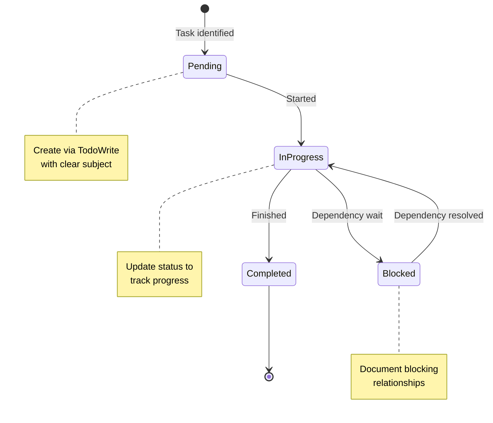

## Problem

During complex multi-step tasks, AI agents lose track of:
- What tasks are pending, in progress, or completed
- Which tasks are blocked by dependencies
- Verification steps that need to run
- Next actions after context switches

This leads to redundant work, forgotten tasks, and confused users.

## Solution

Use `TodoWrite` (or equivalent state externalization) to maintain explicit working memory throughout the session. This serves as both agent and user visibility into session state.

**What to track:**

1. **Task status**: pending, in_progress, completed
2. **Blocking relationships**: What blocks what
3. **Verification steps**: Tests or checks needed
4. **Next actions**: What to do next

**Usage patterns from data:**

| Project | TodoWrite Uses | Session Quality |
|---------|---------------|-----------------|
| nibzard-web | 52 | High (8 positive, 2 corrections) |
| awesome-agentic-patterns | 60 | Medium (1 positive, 5 corrections) |
| marginshot | 36 | No feedback captured |
| 2025-intro-swe | 0 | Simple work, no need |

**Key insights:**

- TodoWrite usage correlates with smoother sessions
- It serves as working memory for both agent and user
- Essential for complex multi-step tasks
- Less critical for simple, straightforward work



## How to use it

**When to use:**

- Working on complex multi-step tasks
- Need to track blocked tasks and dependencies
- Want to maintain session state across operations
- Multiple parallel work streams

**Implementation approach:**

1. **Create tasks proactively**: When you identify work, create a TodoWrite entry
2. **Update status as you go**: Mark tasks in_progress when starting
3. **Document dependencies**: Use `blocks`/`blockedBy` relationships
4. **Mark complete when done**: Only mark tasks completed when truly finished
5. **Keep descriptions clear**: Include enough context for future reference

**Example workflow:**

```
1. User: "Add OAuth login and fix the search bug"
2. Agent creates 2 tasks with TodoWrite
3. Agent marks OAuth task in_progress, starts work
4. Agent realizes OAuth needs database schema change
5. Agent blocks OAuth task, creates schema task
6. Agent completes schema, unblocks OAuth
7. Agent completes OAuth, moves to search bug
8. Agent completes search, marks all done
```

**Anti-pattern prevention:**

- Prevents context loss across context window switches
- Prevents redundant work (doing same task twice)
- Prevents forgotten tasks (user asks "what about X?")
- Prevents unclear session state

## Trade-offs

**Pros:**

- Explicit session state for agent and user
- Dependency tracking prevents blocked work
- Progress visibility builds confidence
- Survives context window switches
- Reduces "what about X?" questions from users

**Cons:**

- Overhead for simple tasks
- Requires discipline to maintain
- Can become cluttered if overused
- May feel bureaucratic for quick one-offs

**When NOT to use:**

- Simple, single-step tasks
- Tasks that complete in seconds
- When user just wants quick answers

## References

* [SKILLS-AGENTIC-LESSONS.md](https://github.com/nibzard/SKILLS-AGENTIC-LESSONS) - Skills based on lessons learned from analyzing 88 real-world Claude conversation sessions
* Related patterns: [Proactive Agent State Externalization](proactive-agent-state-externalization.md), [Task List Pattern](https://docs.anthropic.com/en/docs/build-with-claude/prompt-engineering/task-lists)
