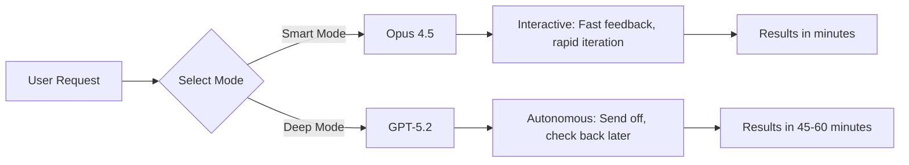

## Problem

Different AI models have fundamentally different personalities and working styles. Treating all models the same—expecting them to work identically—leads to suboptimal outcomes. Users expect a consistent interface, but models like Opus 4.5 are "trigger happy" and want to run commands immediately, while models like GPT-5.2 are "lazy" and prefer thorough research before acting.

## Solution

Design **different agent modes** optimized for each model's personality rather than forcing all models into a single interaction pattern. Each mode should have its own:
- UI/UX patterns (font, prompt length guidance)
- Tool configurations
- Expectation setting
- Working style

**Key insight:** It's not about model selection—it's about **different ways of working**.

**Model personalities identified:**

| Model | Personality | Working Style | Best For |
|-------|-------------|---------------|----------|
| **Claude Opus 4.5** | Trigger happy, interactive | Runs commands, asks questions, rapid feedback loops | Quick back-and-forth, interactive tasks |
| **GPT-5.2** | Lazy, thorough, deep researcher | Goes off for 45+ minutes, researches extensively, comes back with comprehensive results | Well-scoped problems, big tasks, finding information |



**Mode differentiation strategies:**

1. **Visual/UI differentiation**
   - Different fonts for different modes
   - Different prompt length guidance (100+ words minimum for Deep mode)
   - Make it "feel like text message vs writing a letter"

2. **Tool configuration**
   - Smart mode: Tools optimized for rapid execution
   - Deep mode: Tools optimized for thorough research (e.g., no user feedback question tools)

3. **Expectation setting**
   - Smart mode: "Watch the agent work"
   - Deep mode: "Send off and check in 60 minutes later"

**Example from AMP:**

AMP created three distinct modes:
- **Smart Mode**: Opus 4.5 for interactive assistant work
- **Rush Mode**: Haiku for fast, less smart tasks
- **Deep Mode**: GPT-5.2 for thorough research and autonomous work

The team explicitly avoids a "model selector" dropdown and instead presents these as different working modes.

## How to use it

**Implementation checklist:**

- [ ] **Identify model personalities** in your stack through internal testing
- [ ] **Create mode names** that describe the working style, not the model
- [ ] **Differentiate UX** - make each mode feel distinct
- [ ] **Configure tools per mode** - optimize for the model's strength
- [ ] **Set user expectations** - explain when to use each mode

**When to use each mode:**

**Smart Mode (Opus-like):**
- Quick configuration tasks
- Debugging with rapid iteration
- Tasks requiring frequent human feedback
- "Set up my .zshrc and reload it" style tasks

**Deep Mode (GPT-5.2-like):**
- Well-scoped problems
- Big tasks with clear requirements
- Research and information gathering
- "Go investigate this deployment issue" tasks

**Prompting differences:**

```yaml
# Smart mode prompt
style: conversational
length: short to medium
feedback: rapid, interactive

# Deep mode prompt
style: detailed specification
length: long (100+ words recommended)
feedback: minimal, batched at end
```

## Trade-offs

**Pros:**

- **Optimized for each model's strengths**: Better outcomes than one-size-fits-all
- **Clear user expectations**: Users know how to interact with each mode
- **Reduced frustration**: Users don't fight against model's natural tendencies
- **Better outcomes**: Different models get to equally good results via different paths

**Cons:**

- **Increased complexity**: Multiple modes to maintain and document
- **User confusion**: Some users just want "the best model"
- **Model evolution risk**: Personalities change with new versions
- **Testing overhead**: Need to validate each mode independently

**Challenge: Conveying expectations in a text box**

> "It's all text boxes and it's really hard to convey like expectations in a text box when it's all just a text box."

The fundamental challenge: Different modes require fundamentally different user expectations, but the UI (a text box) looks identical. Solutions:
- Visual differentiation (fonts, colors)
- Explicit instructions ("minimum 100 words for Deep mode")
- Mode-specific guidance in the UI

**Key quote:**

> "They both might get to the same results. And I can't even say that deep mode is always better or always writes the better code, but they get to equally good results, but different like Opus is trigger happy. It wants to run stuff. It wants to get back to you and ask. And Deep mode just goes off and does something."

## References

* [Raising an Agent Episode 10: The Assistant is Dead, Long Live the Factory](https://www.youtube.com/watch?v=4rx36wc9ugw) - AMP (Thorsten Ball, Quinn Slack, 2025)
* Related: [Oracle and Worker Multi-Model Approach](oracle-and-worker-multi-model.md), [Progressive Autonomy with Model Evolution](progressive-autonomy-with-model-evolution.md)
