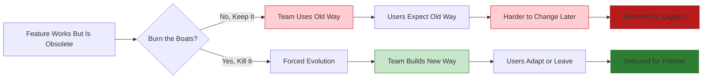

## Problem

In fast-moving AI development, holding onto features or workflows that are "working fine" prevents teams from fully embracing new paradigms. The comfort of existing functionality becomes an anchor that holds back innovation—even when you know the old approach is obsolete.

## Solution

**Burn the boats: intentionally kill features and workflows** to force evolution and prevent being stuck on old paradigms. Set hard deadlines for feature removal to create urgency and commitment to the new way.

**Historical context:** The phrase refers to Captain Hernán Cortés, who destroyed his ships upon arriving in Mexico, eliminating any possibility of retreat. His soldiers had to conquer or die.

**In AI product development:** This means removing features that still work—features users still love—to prevent being stuck on the wrong trajectory.



**Real example from AMP:**

AMP announced they're killing their VS Code extension (and Cursor support) in ~60 days:

> "We will be killing our editor extension, the AMP VS Code extension and cursor and so on. We're going to be killing it. We're going to be killing it because we think it's no longer the future. We think the sidebar is dead."

**Why not just deprioritize it?**

> "It's just a focus thing for us. We can't do that without taking our eye off the thing that you all think is 100 times more important."

If you keep the old feature around:
- Users will keep using it
- You'll feel pressure to maintain it
- Your team splits attention between old and new
- Your user base self-selects for "laggers" rather than frontier users

## How to use it

**Signs it's time to burn the boats:**

1. **The paradigm has shifted**: The fundamental approach has changed (e.g., assistant → factory)
2. **It limits your users**: The feature holds users back from better ways of working
3. **It splits your focus**: Maintaining it distracts from the truly important work
4. **Your future users won't use it**: The 1% of frontier users don't need it
5. **You're only keeping it for comfort**: Not because it's strategically important

**Implementation:**

**1. Set a hard deadline:**

```yaml
feature_kill_plan:
  feature: "VS Code Extension"
  deadline: "~60 days from announcement"
  message: "Will self-destruct in approximately 60 days"
  migration_path: "Use AMP CLI instead"
  rationale: "Sidebar is dead, long live the factory"
```

**2. Give users migration guidance:**

- Explain WHY you're killing it
- Provide clear alternatives
- Encourage feedback on gaps
- Accept that some users may leave

**3. Communicate the rationale:**

From AMP's announcement:

> "We might make it so we just delete this entire directory in our source tree and we're getting together in Singapore in a few weeks and just rewrite it from scratch."

> "We have to totally reearn all of the usage of AMP today, all of the revenue that we're doing, all the customers we have... every 3 months."

**4. Accept user churn:**

Some users will leave. That's OK. You're selecting for the frontier:

> "Our user base will start to become selected not for as it is today the people that are building on the frontier... but our user base will be selected for the laggers and that will make it even harder for us to change."

## Trade-offs

**Pros:**

- **Forces internal innovation**: No safety net, must build the new way
- **Signals commitment**: Shows users and team you're serious
- **Avoids split focus**: No resources diverted to maintaining obsolete features
- **Selects for the right users**: Frontier users stay, lagers leave (or upgrade)
- **Prevents stagnation**: Can't get comfortable resting on laurels

**Cons:**

- **User churn**: Some users will leave (or stay on old versions)
- **Revenue impact**: Short-term revenue may decrease
- **Risk of being wrong**: What if the new way isn't actually better?
- **Team morale**: Some team members may resist killing their work
- **Competitive vulnerability**: Competitors may support the "old way" longer

**The self-destruct timer pattern:**

AMP implemented a literal self-destruct timer in their VS Code extension:

> "It will self-destruct in about 60 days from now. We don't know exactly when. We'll put the timer. You'll see it."

This creates urgency and inevitability. Users can't ignore it.

**When NOT to burn the boats:**

- The feature is core to your value proposition
- You don't have a clear alternative
- The new way is unproven and risky
- Your team isn't aligned on the change
- Killing it would destroy the business

**Related principle: Re-earn revenue every quarter**

> "All of the usage of AMP today, all of the revenue that we're doing, all the customers we have, we have to totally reearn that like every 3 months. The product is going to look different. You're going to use it for different things in different ways. You're going to pay us for different things."

Burning boats is part of this mindset: nothing is sacred, everything must be re-earned.

## References

* [Raising an Agent Episode 10: The Assistant is Dead, Long Live the Factory](https://www.youtube.com/watch?v=4rx36wc9ugw) - AMP (Thorsten Ball, Quinn Slack, 2025)
* Related: [Disposable Scaffolding Over Durable Features](disposable-scaffolding-over-durable-features.md), [Factory over Assistant](factory-over-assistant.md)
