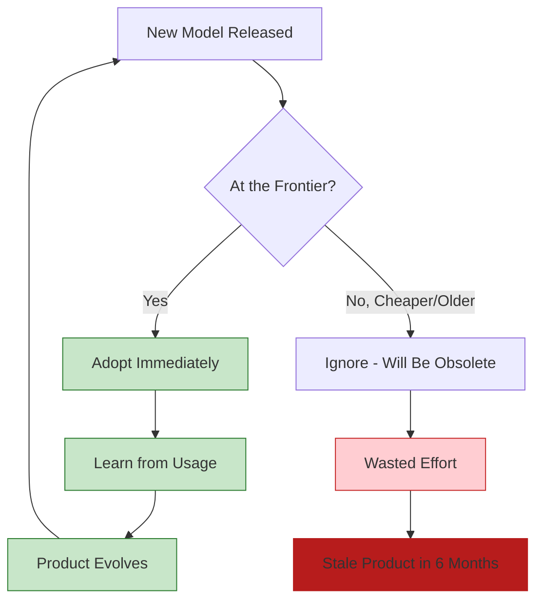

## Problem

AI capabilities are advancing so rapidly that products optimized for today's models will be obsolete in months. Many teams waste time solving problems that new models already solve, or build products tied to specific models that won't stay competitive.

## Solution

**Always target the frontier**—the state-of-the-art models—and design products that can rapidly evolve as the frontier moves. Don't optimize for older, cheaper models, and don't offer model selectors that trap users in the past.

**Core principles:**

1. **No model selector**: Pick the best model for each use case, don't let users choose
2. **Frontier or nothing**: Only build features that push boundaries and generate learning
3. **Rapid evolution**: Expect to completely change your product every 3 months
4. **Subscription resistance**: Avoid being tied to one model's pricing structure



**The problem with optimizing for cost:**

> "If you do this right now and you try to make non-frontier models work and optimize for cost, what you're doing is you're building something that will be outdated in half a year... and you're building it for people who by the very definition do not want to pay a lot."

## How to use it

**Decision framework for feature/build choices:**

```yaml
frontier_test:
  question_1: "What will we learn from this?"
  question_2: "Does this push the frontier?"
  question_3: "Will this still be valuable in 3 months?"

  if_no_to_any: "Don't build it"
  if_yes_to_all: "Build it"
```

**Model strategy:**

| Approach | Problem | Solution |
|----------|---------|----------|
| **Model selector** | Users stuck on old models, no learning | Pick best model per mode, no user choice |
| **Cost optimization** | Solving problems new models solve | Use frontier, cost will drop over time |
| **Subscription tie-in** | Locked to one model's roadmap | Pay-as-you-go, switch models anytime |
| **Multi-model support** | Maintenance nightmare, confusion | Use best model, switch when better emerges |

**Why no model selector?**

1. **Learning**: Can't learn how users interact if everyone uses different models
2. **Focus**: One way to use the product means everyone benefits from improvements
3. **Evolution**: Not beholden to models that were popular 3-6 months ago
4. **Quality**: Can optimize specifically for the best model's capabilities

> "If you're using AMP it's only possible to be used in the way that we think is good. At least we try to make it really hard to use in an archaic way."

**The risk of subscription models:**

When you offer a subscription (like Claude Max), you become tied to that model:
- Can't switch if a better model emerges
- Price changes become user-hostile
- Roadmap decisions dictated by one company

> "If the models that the sub offered access to suddenly became not the best models that we wanted to use in AMP, then if we were to switch, we would have a lot of users who say, 'Well, you just jacked up my price by 10 times or more.'"

## Trade-offs

**Pros:**

- **Always at the frontier**: Your product improves as models improve
- **Rapid learning**: Focused usage generates clear insights
- **Future-proof**: Can switch models instantly when something better emerges
- **Quality focus**: Optimize for best capabilities, not lowest common denominator
- **Innovation**: Positioned to discover what's possible with frontier models

**Cons:**

- **Higher costs**: Frontier models are more expensive (for now)
- **Smaller market**: Some users won't pay for frontier performance
- **Rapid change**: Product may look completely different in 3 months
- **Exclusionary**: Not building for "median" users who want stability
- **Uncertainty**: Constantly reinventing rather than stabilizing

**When frontier focus works:**

- Targeting early adopters and frontier users
- Building for developers who value speed over cost
- Small teams that can pivot quickly
- Products where AI capability is the core differentiator
- Users who want to be on the cutting edge

**When to consider alternatives:**

- Enterprise customers requiring stability
- Cost-sensitive markets where performance isn't critical
- Products where AI is a minor feature, not core value
- Large teams that can't change direction quarterly

**The "primordial soup" of agents:**

When everything is in flux—the models, the software, how we write it—optimizing for stability is a losing strategy. Embrace the chaos:

> "A lot of the software we're seeing now has this non-deterministic element in it called LLM. So the software itself is changing. How we write software is changing. Who or what writes software is changing."

## References

* [Raising an Agent Episode 9: The Assistant is Dead, Long Live the Factory](https://www.youtube.com/watch?v=2wjnV6F2arc) - AMP (Thorsten Ball, Quinn Slack, 2025)
* Related: [Disposable Scaffolding Over Durable Features](disposable-scaffolding-over-durable-features.md), [Agent Modes by Model Personality](agent-modes-by-model-personality.md)
