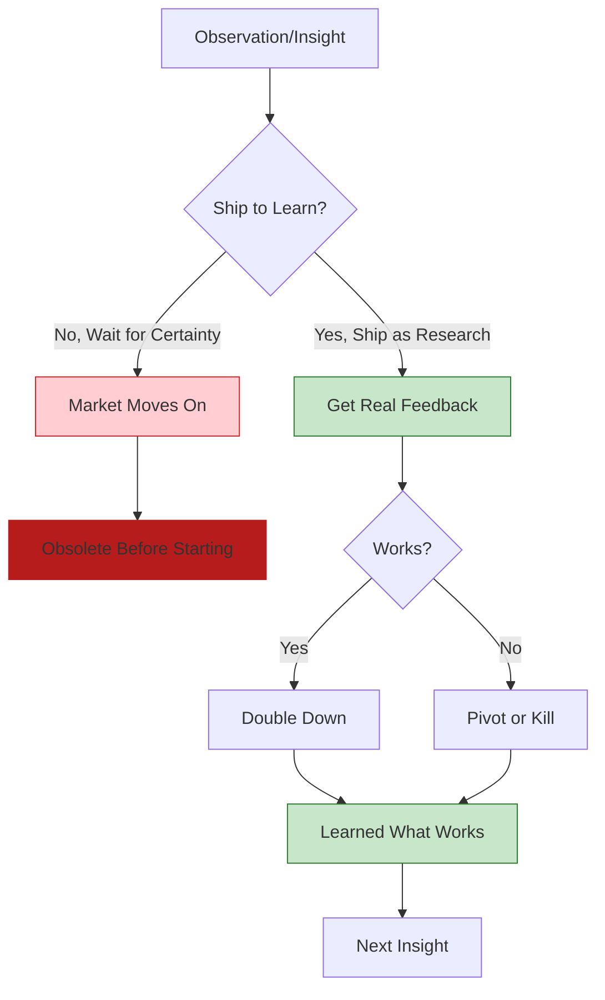

## Problem

In the rapidly evolving AI landscape, waiting for certainty before building means you're always behind. Traditional product development emphasizes validation and certainty before release, but when the market changes every 3-6 weeks, you can't afford to wait.

## Solution

**Treat shipping as research**: release features not because you're certain they'll work, but to learn whether they work. Ship to figure out what works and doesn't work. Let reality and customer feedback guide your evolution.

**The alternative—sitting out—doesn't work:**

> "A lot of big companies have this where they're like, well, we're going to sit this one out. This is too crazy for us. We're going to wait and see where the dice are going to fall and then we're going to build for this."

But if you wait for the dice to fall, you'll be too far away to catch up.



**Key insight:** The frontier is moving so fast that you must ship to discover what works. Analysis and planning can't keep up with the rate of change.

**Research mindset vs. Product mindset:**

| Product Mindset | Research Mindset |
|-----------------|------------------|
| Ship when polished | Ship to learn |
| Validate before release | Release to validate |
| Features must last | Features may die in 3 months |
| Customer acquisition | Customer learning |
| Revenue optimization | Insight optimization |

**Real example from AMP:**

AMP has ripped out multiple features that users loved:
- To-dos
- Forking
- Tabs
- Custom commands
- VS Code extension (forthcoming)

Each removal was greeted positively by users:

> "People actually really like it when we remove stuff. They were like, 'This is good. Cut the stuff that we've all know doesn't work anymore.'"

Shipping as research means being willing to both add AND remove features rapidly based on what you learn.

## How to use it

**Principles for shipping as research:**

**1. Ship before you're certain:**

```yaml
shipping_criteria:
  required:
    - Doesn't break existing functionality
    - Team believes it's worth trying
    - Can be reversed if needed

  not_required:
    - Certainty it will work
    - Perfect polish
    - Business case proven
    - User research validation
```

**2. Design for reversibility:**

Build features so they can be easily removed:
- Minimal dependencies
- Clean interfaces
- No deep coupling
- Monitor usage from day one

**3. Communicate the experimental nature:**

Let users know they're part of the research:
> "We're trying this out. We don't know if it'll work. Help us learn."

**4. Measure everything:**

You can't learn without data:
- Usage metrics
- Success/failure rates
- User feedback patterns
- Performance characteristics

**5. Kill quickly:**

When something isn't working, remove it:

> "We ripped out four features or something. We ripped out to-dos, we ripped out forking, we ripped out tabs..."

> "I was like oh people won't care about this... and yet another removal, but we did and people actually really like it when we remove stuff."

**The "art installation" mindset:**

AMP describes themselves as "more like an art installation than a software company":

> "What if AMP itself self-destructs? Like what if you know basically we saying like well AMP is gone here's the new AMP... the construction and destruction of AMP you know like we joked about this but the funny thing is our customers appreciate this."

This mindset embraces constant change and experimentation.

## Trade-offs

**Pros:**

- **Speed**: Learn faster than competitors who wait for certainty
- **Real-world validation**: Actual usage trumps theoretical analysis
- **User goodwill**: Frontier users appreciate being part of the journey
- **Agility**: Can pivot quickly when something doesn't work
- **Innovation**: Discover approaches that planning would miss

**Cons:**

- **Wasted effort**: Some features will be built and then killed
- **User confusion**: Constant change can disorient users
- **Churn**: Some users prefer stability over experimentation
- **Brand risk**: Public failures can damage reputation
- **Resource inefficiency**: Building throwaway features seems wasteful

**When shipping as research works best:**

- Your user base is early adopters who understand experimentation
- You're on a rapidly evolving frontier (like AI agents)
- You're small enough to pivot quickly
- Your users value being on the cutting edge
- The cost of being wrong is low (reversible features)

**When to be more cautious:**

- Safety-critical applications
- Established markets with slow change
- Large enterprises with stability requirements
- Features with high switching costs
- Regulatory or compliance concerns

**The danger of sitting out:**

> "You might be too far away from where the dice will fall."

If you wait to see what happens before acting, you'll miss the window. The frontier moves too fast.

> "You need to constantly look up and see where they're going and trying to follow them. And you need to ship and hit reality and get customer feedback from customers such as ours to figure out what's going on, what's working and isn't working."

## References

* [Raising an Agent Episode 10: The Assistant is Dead, Long Live the Factory](https://www.youtube.com/watch?v=4rx36wc9ugw) - AMP (Thorsten Ball, Quinn Slack, 2025)
* Related: [Burn the Boats](burn-the-boats.md), [Disposable Scaffolding Over Durable Features](disposable-scaffolding-over-durable-features.md), [Dogfooding with Rapid Iteration for Agent Improvement](dogfooding-with-rapid-iteration-for-agent-improvement.md)
