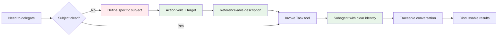

## Problem

When delegating work to subagents via the Task tool, empty or generic task subjects make conversations:

- **Untraceable**: Cannot identify what a subagent was working on
- **Unreferencable**: Cannot discuss specific subagent work later
- **Confusing**: Multiple subagents with empty subjects are indistinguishable

From 48 Task invocations across 88 sessions, empty task subjects were identified as a major pain point.

## Solution

Enforce clear, specific task subjects for every Task tool invocation. A good subject should:

1. **Not be empty** (baseline requirement)
2. **Be specific and descriptive** (what is being done)
3. **Be reference-able** (can be discussed later)
4. **Follow naming conventions** (imperative mood, clear target)

**Examples:**

❌ **Bad subjects:**
- `""` (empty)
- `"research"`
- `"explore"`
- `"task"`

✅ **Good subjects:**
- `"Explore newsletter component implementation"`
- `"Search for dark mode patterns in codebase"`
- `"Analyze error handling in API routes"`
- `"Find all OAuth configuration files"`



## How to use it

**Before invoking Task tool**, verify the subject meets all criteria:

1. **Length check**: Minimum 3-4 words
2. **Action check**: Starts with verb (Explore, Analyze, Search, Find)
3. **Target check**: Specifies what is being acted upon
4. **Reference check**: Could you point to this conversation later and say "the one that [subject]"?

**Template for good subjects:**

```
[Action Verb] + [Target/Scope] + [Optional Context]
```

Examples:
- "Explore + newsletter component + implementation details"
- "Search + codebase + for dark mode patterns"
- "Analyze + API routes + error handling approach"
- "Find + all OAuth + configuration files"

**Anti-pattern prevention:**

Prevents "Empty Subject Anti-Pattern" which makes conversations untraceable and subagent work indistinguishable.

**Real-world impact:**

From nibzard-web session with 4 parallel subagents:
- agent-a7911db: "Newsletter component exploration"
- agent-adeac17: "Modal pattern discovery"
- agent-a03b9c9: "Search implementation research"
- agent-b84c3d1: "Log page analysis"

Clear subjects enabled the main agent to synthesize findings from each subagent effectively.

## Trade-offs

**Pros:**

- Traceable subagent conversations
- Reference-able work items
- Clearer synthesis of parallel work
- Better communication with user
- Easier debugging of delegation issues

**Cons:**

- Requires upfront thinking about subject
- Longer subject strings (minor overhead)
- No technical enforcement (requires discipline)

**When it matters most:**

- Parallel subagent delegations (2+ agents)
- Complex research tasks
- Long-running subagent work
- When user needs to review subagent output

## References

* [SKILLS-AGENTIC-LESSONS.md](https://github.com/nibzard/SKILLS-AGENTIC-LESSONS) - Skills based on lessons learned from analyzing 88 real-world Claude conversation sessions
* Related patterns: [Sub-Agent Spawning](sub-agent-spawning.md), [Parallel Tool Call Learning](parallel-tool-call-learning.md)
