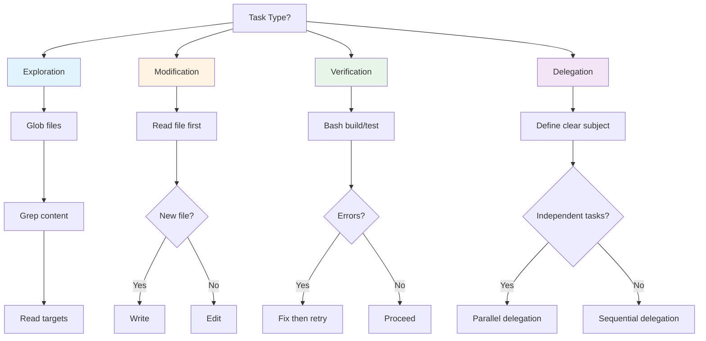

## Problem

AI agents often struggle to select the optimal tool for a given task, leading to inefficient workflows. Common anti-patterns include:

- Using `Write` when `Edit` would be more appropriate
- Launching subagents for simple exploration tasks
- Skipping build verification after code changes
- Performing sequential exploration when parallel would be faster

These ineff compound across long sessions, resulting in wasted tokens, slower completion, and more user corrections.

## Solution

Encode data-driven tool selection patterns that emerged from analysis of 88 real-world Claude conversation sessions. By matching task type to optimal tool, agents can follow proven workflows.

**Tool preference patterns from actual usage data:**

| Task Type | Recommended Tool | Evidence |
|-----------|-----------------|----------|
| Codebase exploration | Read → Grep → Glob | Consistent pattern across all projects |
| Code modification | Edit (not Write) | 3.4:1 Edit:Write ratio in nibzard-web |
| New file creation | Write | Appropriate use case |
| Build verification | Bash | 324 uses in nibzard-web, 276 in patterns |
| Research delegation | Task (with clear subject) | 48 invocations across sessions |

**Key selection criteria:**

1. **Exploration tasks** (discovering code structure, finding patterns):
   - Start with `Glob` for file discovery
   - Use `Grep` for content search (syntax-aware when available)
   - Use `Read` for targeted file inspection

2. **Code modification tasks** (changing existing code):
   - **Prefer `Edit` over `Write`** - preserves existing context and comments
   - Only use `Write` for brand new files or complete rewrites (with permission)
   - Always `Read` the file before editing

3. **Verification tasks** (testing, building, checking):
   - Use `Bash` for build commands, test runners, and linting
   - Run verification **after** every Edit/Write operation
   - Check for errors/warnings before proceeding

4. **Delegation tasks** (parallel exploration):
   - Use `Task` tool for subagent delegation
   - **Always provide clear task subjects** (no empty strings)
   - Prefer parallel over sequential for independent exploration

## How to use it

**Before using any tool**, mentally categorize the task:

- "Am I discovering something?" → Exploration toolkit
- "Am I changing something?" → Edit (after Read)
- "Am I checking something?" → Bash verification
- "Am I delegating something?" → Task with clear subject

**Anti-pattern prevention:**

- Don't use `Write` for modifications (use `Edit`)
- Don't skip `Read` before `Edit`
- Don't claim work complete without `Bash` verification
- Don't use empty task subjects in `Task` invocations
- Don't explore sequentially when parallel is possible

## Trade-offs

**Pros:**

- Data-driven from 88 real sessions
- Reduces token waste and user corrections
- Faster workflow completion
- Clear mental model for tool selection
- Prevents common anti-patterns

**Cons:**

- Requires tool availability (e.g., Bash for verification)
- Parallel delegation increases cost
- May feel slower for simple one-off tasks
- Requires discipline to follow patterns consistently

## References

* [SKILLS-AGENTIC-LESSONS.md](https://github.com/nibzard/SKILLS-AGENTIC-LESSONS) - Skills based on lessons learned from analyzing 88 real-world Claude conversation sessions
* Related patterns: [Sub-Agent Spawning](sub-agent-spawning.md), [Discrete Phase Separation](discrete-phase-separation.md), [Subject Hygiene](subject-hygiene.md)
